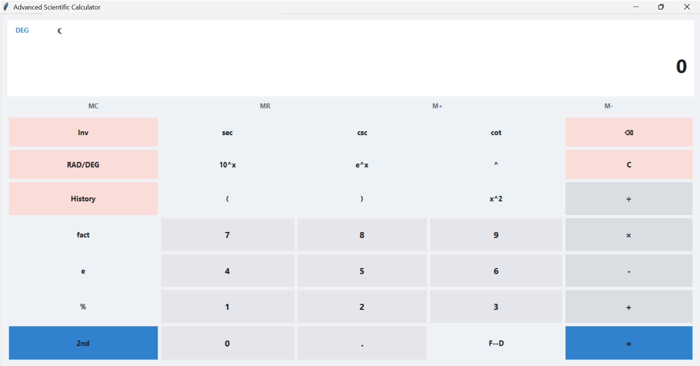
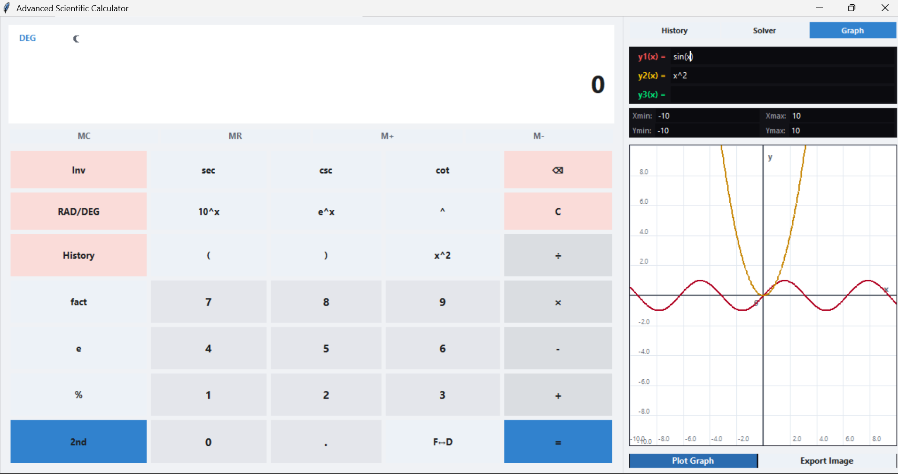
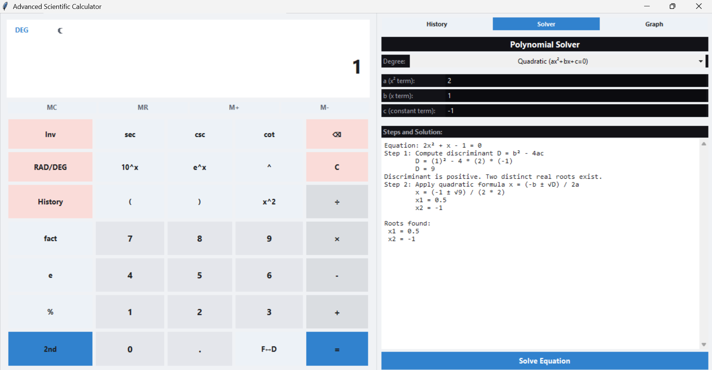

# 🧠 Advanced Scientific Calculator

### Transforming a Calculator into a Complete Mathematical Workspace

A modern desktop scientific calculator built with Python that combines advanced computation, graph visualization, polynomial solving, history management, and a modern user experience into one powerful application.

---

## 🌟 Why This Project?

Most calculators are designed only for basic arithmetic operations.

This project was built to provide a richer mathematical experience by combining:

- Scientific Computing
- Interactive Graph Visualization
- Polynomial Equation Solving
- Exact Mathematical Representation
- Calculation History Management
- Modern User Interface Design

The goal was to create a calculator that feels closer to a professional mathematical workstation than a traditional calculator.

---

## 📸 Application Preview

### 🌙 Dark Theme


### ☀️ Light Theme



### 📈 Graph Plotting



### 🧮 Polynomial Solver



---

## ✨ Features

### 🧮 Advanced Calculations

Perform:

* Addition, Subtraction, Multiplication, Division
* Percentage Calculations
* Powers and Exponents
* Square Roots
* Factorials
* Logarithmic Functions
* Natural Logarithms
* Mathematical Constants (π, e)

---

### 📐 Trigonometric Engine

Support for:

* sin(x)
* cos(x)
* tan(x)
* sec(x)
* cosec(x)
* cot(x)

Inverse Functions:

* sin⁻¹(x)
* cos⁻¹(x)
* tan⁻¹(x)
* sec⁻¹(x)
* cosec⁻¹(x)
* cot⁻¹(x)

Additional Features:

- Degree (DEG) Mode
- Radian (RAD) Mode
- Exact Mathematical Representation
- Fraction-Based Outputs
- Decimal ↔ Fraction Conversion

### 📊 Interactive Function Graphing

Graph Features:

- Real-Time Graph Plotting
- Zoom In / Zoom Out
- Axis Labels
- High-Resolution PNG Export

### 💾 Memory Functions

Professional calculator memory operations:

- MC (Memory Clear)
- MR (Memory Recall)
- M+ (Memory Add)
- M− (Memory Subtract)

### 🎨 Modern Desktop Experience

Designed with usability and aesthetics in mind.

Features:

* Dark Theme
* Light Theme
* Smooth UI Interactions
* Responsive Layout
* Professional Design Language
* Hover Effects
* Keyboard Navigation

---

### ⚡ Productivity Features

* Full Keyboard Support
* Clipboard Integration
* Memory Functions (MC, MR, M+, M−)
* Decimal ↔ Fraction Conversion
* Expression Sanitization
* Error Validation

---

## 🏗️ Project Architecture

```text
scientific_calculator/
│
├── main.py
├── ui.py
├── engine.py
├── solver.py
├── history.py
├── test_calculator.py
│
├── assets/
├── screenshots/
└── exports/
```

---

## 🛠️ Technology Stack

| Technology | Role                   |
| ---------- | ---------------------- |
| Python     | Core Application Logic |
| Tkinter    | Desktop User Interface |
| Matplotlib | Graph Rendering        |
| NumPy      | Numerical Computation  |
| SymPy      | Symbolic Mathematics   |
| JSON       | Data Persistence       |
| CSV        | Export System          |

---

## 🚀 Installation

### Clone Repository

```bash
git clone https://github.com/YOUR_USERNAME/Advanced-Scientific-Calculator.git
cd Advanced-Scientific-Calculator
```

### Run Application

```bash
python scientific_calculator/main.py
```

### Execute Tests

```bash
python scientific_calculator/test_calculator.py
```

---

## 🎯 Future Enhancements

- Matrix Calculator
- Statistics Module
- Unit Conversion System
- Scientific Notation Tools
- PDF Export
- LaTeX Export
- Advanced Calculus Engine
- Plugin Architecture

---

## 👨‍💻 Author

### Shivnandan Pathak

**B.Tech Computer Science Student | Software Developer | Cloud & AI Enthusiast**

Passionate about building practical software solutions, mathematical tools, cloud-based systems, and AI-powered applications.

---

## ⭐ Support

If you found this project useful, consider giving the repository a star.
It helps the project reach more developers and motivates future improvements.